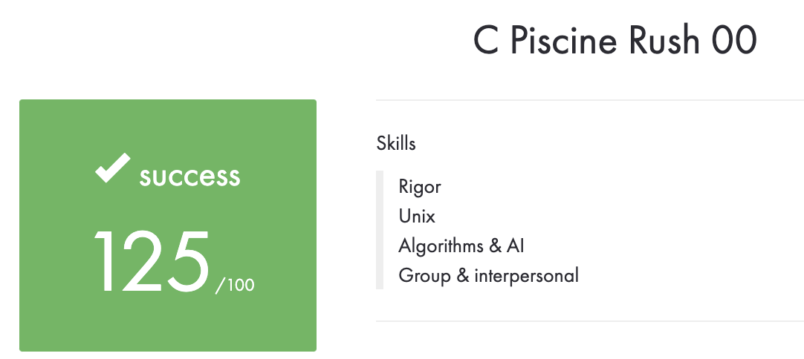

# Rush00
Subject is in the file Rush00.pdf.

The Rush function taking two variables and display a rectangle for x characters for width, and y characters for lenght.

P.S. These are school projects, they were limited by certain conditions and rules for writing code. Therefore, do not be surprised that everything is output through write or the while loop is used everywhere, etc. =)

